 
<!-- My Typing Effect code -->

<!-- My Profile Typing SVG -->
  

<!-- My Profile Views Counter -->

  

<!--My Personal Details -->
### 🌱 I'm currently learning **Java, C, Python**
### 💬 Ask me about **C, Java**
### 📫 How to reach me: [LinkedIn](https://www.linkedin.com/in/shanilka-disanayaka))

## Connect with me:

<!-- -->

## Languages and Tools:

## GitHub Stats:

  
<!-- # Profile Skin: "GitSkins Curation" -->

  

---

## Active GitSkin: Bronzed Professional

| Stat               | Active Value | Notes                             |
|--------------------|--------------|-----------------------------------|
| **Vibe**           | Modern       | Profile curated for professional tech |
| **Primary Color**  | Deep Black   | Base theme color                   |
| **Accessory Spot** | Glasses & Watch detected | Highlighted with copper glow       |
| **Most Active Lang**| Python       | The copper-themed language         |

---
 ## 🐍 Contribution Snake Animation

 <!--Snake Animation code -->

  

## 🚀 Key Achievements

Here is my latest activity data, color-curated for this skin.

  <!-- Dynamic, animated Contribution Graph widget by GitSkins -->
  

---

## Pinned Projects (Preview)

Here are a few projects I'm particularly proud of.

  

